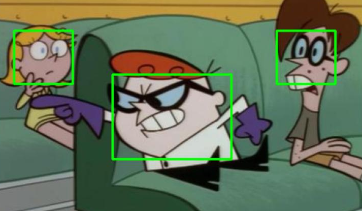

#  Dexter Face Detection Classification using CNN and YOLOv8 in Python 

## Features 
- Generating positive examples
- Generating negative examples
- Kmeans for sliding window sizes
- Training with CNN Arhitecture
- YOLO configuration and training

## Image

## Contact

**Email**: mariusc0023@gmail.com
